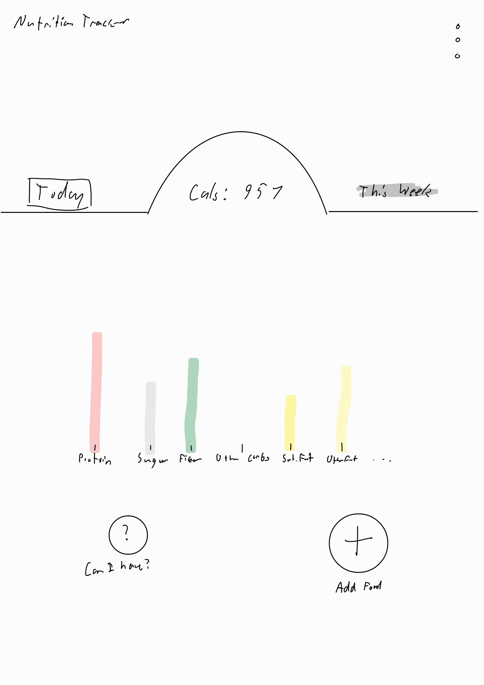

## Startup Repository
Startup assignment for BYU CS 260

These are [notes](notes.md) \\(￣︶￣*\\)) 

# Nutrition Tracker: Startup Spec

## Macro Tracking Made Simple...
Have you ever felt like you needed to make substantial change in your diet, but loathed the thought of staring at nutrition labels each time you sat down to eat or went to the store? 

No more! Nutrition Tracker will... well... track your nutrition! Eat time you eat, simply open up the app, select the food items you consumed, and watch as Nutrition Tracker tallies up calories, protein, fiber, carbohydrates, sugar, fats and other nutrients through the day to help you meet your goals.

## Key Features
- Search food items in the USDA FoodData Central database to obtain their nutrition information.
- Track nutrient stats per user, per day.
- "Can I Have...?" feature to show how a food item will affect users daily nutrition.
- Track users previous entries and store them for quick access.

## Use of Technologies
- **HTML** - For structure. Pages for Login, Daily View, and Weekly/Monthly View (plus widgets and modals for different features)
- **CSS** - Application styling that looks good on different screen sizes (but especially mobile phones), uses good whitespace, color choice and contrast.
- **JavaScript** - Provides login, nutrition stats (as graphs), submitting food items, backend endpoint calls.
- **React** - Single page application with views componentized and reactive to user's actions.
- **Services** - Backend service with endpoints for:
    - Obtaining User Nutrition Information
    - Obtaining User common food choices
    - Submitting consumed food
    - Obtaining Food Nutrition Facts (from either Nutritionix or FoodData Central, depending on what works better)
- **DB/Login** - Store user info, nutrient stats, common choices, and credentials in persistent database. Must be authenticated before submitting foods.
- **WebSocket** - Distribute health tips from the server to users as they use the app.

## Mockup
